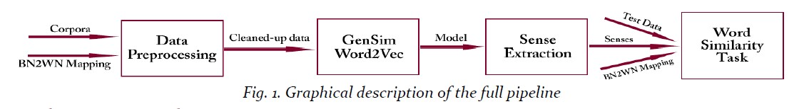
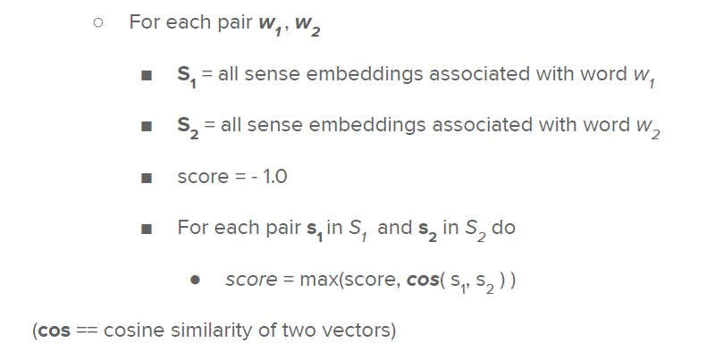

# GenSim Word Sense Embeddings

This project implements the paper [SensEmbed: Learning Sense Embeddings for Word and Relational Similarity](https://www.aclweb.org/anthology/P15-1010/).
The task is as follows:
1. to train Word2Vec sense embeddings using annotated English sentences from a [the EuroSense corpora](http://lcl.uniroma1.it/eurosense/), and 
2. to implement a word-similarity task to test evaluate the trained embeddings. 

The image below is a graphical representation of the full pipeline of this implementation:



[Read the report here](report.pdf)

This project was done as part of a graduate degree NLP course with [Prof. Navigli](http://wwwusers.di.uniroma1.it/~navigli/) ([BabelNet](https://babelnet.org/)) at Sapienza University of Rome and was graded as very good.


## How to train

This repo contains an already trained sense embeddings `resources/embeddings.vec`, and the validation dataset in the `/wordsim353` folder, so things can be tested rightaway.

To train, download [the EuroSense corpora](http://lcl.uniroma1.it/eurosense/) (it's large!), extract it, then follow the code in [the notebook](code/unigrams_only_notebook.ipynb) in the `/code` folder (don't forget to consolidate the paths to correspond with the new paths).

Training consists of parsing and preprocessing the corpora, and training the embeddings using [GenSim's Word2Vec](https://radimrehurek.com/gensim/models/word2vec.html) (requires the installation of GenSim). 
The code to preprocess is the `parse()` function in `code/corpora.py`. The function both extracts the sentences in the xml corpora and preprocesses them. The usage is as follows:

```
from corpora import *

corpora_path = '../EuroSense/eurosense.v1.0.high-coverage.xml'
bn2wn_mapping_path = '../resources/bn2wn_mapping.txt'
outfile_path = '../EuroSense/sentenses_coverage.txt'

parse(corpora_path, bn2wn_mapping_path, outfile_path, "coverage")
```

Please note that the sense embeddings are created only for matching [BabelNet](https://babelnet.org/) and [WordNet](https://wordnet.princeton.edu/) synsets and this was written into the `parse()` function

Given the size of the training data, it makes sense to feed it to GenSim's Word2Vec function using a generator. The generator function I defined is `InputSentences()` and can be found in the `code/my_utils.py` file. The only parameter it takes is the path to the extracted dataset from above, and returns a generator object that is fed as the dataset to the GenSim's Word2Vec function.

Since we only care about the embeddings for the senses, saving the model is done in a specific way (`save_embeddings()` in `code/my_utils.py`) to extract only the senses from all the embeddings trained by Word2Vec.


## How to test

Testing word embeddings is different than one would for a regular machine learning model with regular accuracy and score metrics. A word similarity task is implemented for this project, which consists of measuring the similarity/relatedness between pairs of words from a word [similarity dataset](http://www.cs.technion.ac.il/~gabr/resources/data/wordsim353/wordsim353.zip). 
The word similarity dataset consists of a list of pairs of words with a score of similarity established by human annotators for each pair;
```
Word1		Word2 		Gold
--------	--------	-----
tiger		cat 		7.35
book		paper 		7.46
computer	keyboard 	7.62
```
The task consists of two parts; computing the cosine similarities between every pairs of words in the dataset, and computing the spearman correlation between the gold similarity scores and the cosine similarity scores. The algorithm for computing the cosine similarities is as follows:



We end up getting something like:
```
Word1 		Word2 		Gold 	Cosine
-------- 	-------- 	----- 	------
tiger 		cat 		7.35 	0.452
book 		paper 		7.46 	0.784
computer 	keyboard 	7.62 	0.643
```
And then the spearman correlation:
```
Spearman([7.35, 7.46, 7.62], [0.452, 0.784, 0.643]) = 0.5
```

The word similarity task is implemented in `code/score.py` and only the `spearman()` function needs to be called with path to the test dataset and the path to the saved sense embeddings.

See how all the parts are work together in [the notebook](code/unigrams_only_notebook.ipynb)
